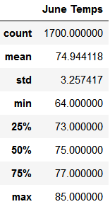
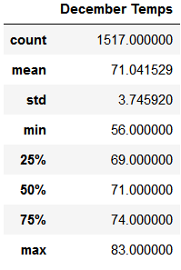

# Oahu Weather Analysis

## Overview
<!-- want to open a surf and ice cream shop in Oahu, analyzing weather data to see if it would be supported -->
We examine weather data from Oahu, Hawaii, to determine if a surf and ice cream shop would be sustainable year round.  We specifically looked at temperatures for the months of June and December over several years.  In the *Results* section of this report, we compare summary statistics for each month.  In the *Summary* section we discuss options for further analysis.

## Results

We used Python's SQLAlchemy module to read in and query the data stored in [hawaii.sqlite](hawaii.sqlite).  To filter by month, we used the following query:
``` Python
session.query(Measurement.date, Measurement.tobs).filter(Measurement.date.contains('-12-'))
```
substituting '-06-' for the '-12-' to filter for dates in June.  The results from the queries were transformed to Pandas DataFrames, from which we used the `describe()` method to get the summary statistics below.

   

As we can see, June has more observations than December, but both have enough values to be meaningful representations.  My main observations are as follows:
* *Average Temperature*
  * The average temperature in June was nearly 75°F, approximately 4°F higher than December's average of 71°F.  
  * These average temperatures match the median temperatures almost exactly, showing a standard deviation and indicating that half of the recorded temperatures for each month are higher than these means.
* *Lowest Temperature* 
  * The lowest recorded temperature was 64°F in June, and 56°F in December.
  * The 25th-percentile for June falls at 71°F, and the 25th-percentile for December is 69°F.
* *Highest Temperature*
  * The highest recorded temperature was 85°F in June, and 83°F in December.

## Summary

The mean and high temperatures for both June and December are very similar, within 4°F of each other in both cases.  With half of the recorded temperatures being higher than the means, we can conclude that many days in December would be comparable to June.  The main difference lies with the low temperatures: December grew 8°F colder than June.  Looking at the 1st quartiles, we see both are within 1°F of 70°F, so 75% of temperatures for each month are at or over 70°F.  From this, if we assume June temperatures will support a surf and ice cream shop, we can conclude December's temperatures will as well.  

However, temperature is not the only indication of weather.  To be more confident in this shop, we should also look into factors like cloud coverage, wind speed, wave conditions, and precipitation.  The data available to us already tracks precipitation, we could perform a very similar query to look at both temperature and precipitation data, as follows:
``` Python
session.query(Measurement.date, Measurement.tobs, Measurement.prcp).filter(Measurement.date.contains('-12-'))
```
Oahu also isn't a perfectly flat island, in fact it's highest mountain Ka'ala reaches an elevation of 4,025 feet[^1].  As our data comes from 9 stations across the island, it would also be useful to filter by station.  The stations' elevations and names are included in our SQLite database, so we could choose stations based on either the listed location or more detailed research on the location of each station.  To add a station filter, our new query would look something like this (though in this example I simply listed the three stations with the most reports): 
``` Python
list = []
stations = ['USC00519281', 'USC00519397', 'USC00513117']
for station in stations:
    query = session.query(Measurement.date, Measurement.tobs, Measurement.prcp).\
        filter(Measurement.date.contains('-12-')).\
        filter(Measurement.station == station)
    list = list + query.all()
```

The temperature on a mountain could easily be different than that at sea level, so I think it's important to account for elevation and precipitation in addition to temperature.

[^1]: [https://en.wikipedia.org/wiki/Ka%CA%BBala](https://en.wikipedia.org/wiki/Ka%CA%BBala)
